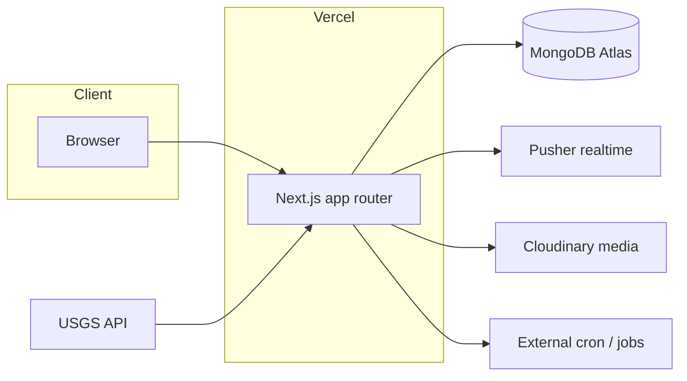
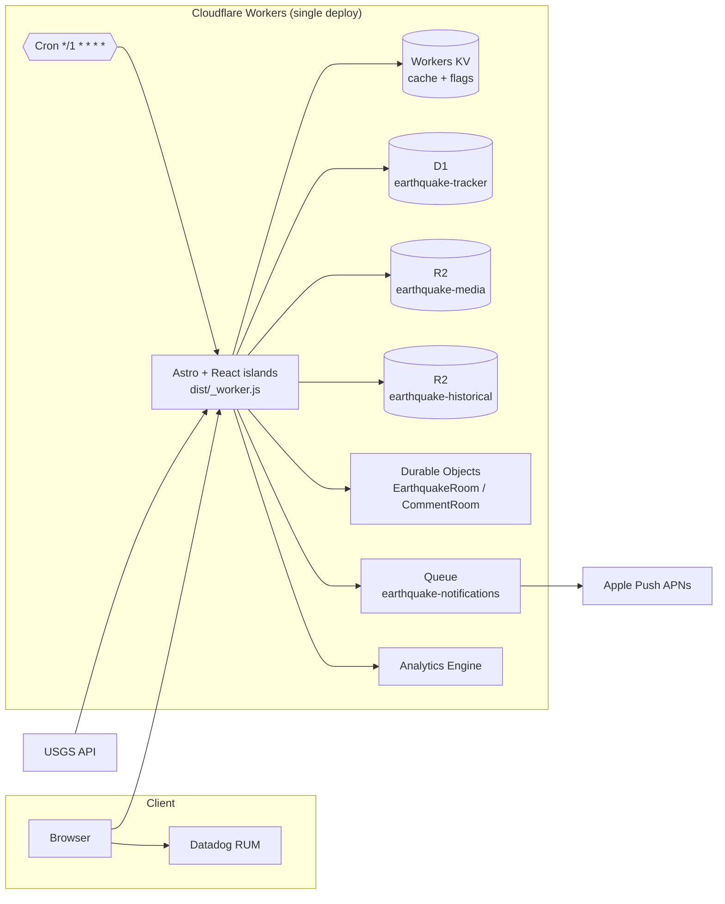

# BayTremor Architecture — Before / After

A before/after view of the platform migration captured across two commits:

- **`d2b59b0`** — *feat: Astro/Cloudflare migration cleanup* (Next.js/Vercel → Astro/Cloudflare Workers; removed ~36k lines of legacy Next.js code).
- **`fd89f25`** — *feat(earthquakes): persist USGS quakes to D1 + close history gap* (MongoDB Atlas → Cloudflare D1 data layer).

---

## 1. TL;DR — Simple Text Arrows

```
Framework      Next.js (app router)     →  Astro 5 + React 19 islands
Host / Runtime Vercel                   →  Cloudflare Workers
Database       MongoDB Atlas            →  Cloudflare D1 (SQLite)
Real-time      Pusher                   →  Durable Objects (EarthquakeRoom, CommentRoom)
Media/Images   Cloudinary               →  Cloudflare R2 (earthquake-media)
Historical     (n/a / ad hoc)           →  Cloudflare R2 (earthquake-historical, 15+ yrs USGS)
Cache/State    (external)               →  Workers KV (EARTHQUAKE_KV, FEATURE_FLAGS_KV)
Async jobs     (external / none)         →  Cloudflare Queues (earthquake-notifications → APNs)
Scheduling     (external cron)          →  Workers Cron Trigger (USGS poll every 60s)
Analytics      (external)               →  Workers Analytics Engine (earthquake_events)
Monitoring     (none / basic)           →  Datadog Browser RUM (100% session + replay)
```

**One-liner:** A multi-vendor Next.js/Vercel/Mongo/Pusher/Cloudinary stack collapsed into a **single Cloudflare Workers deployment** with D1, R2, KV, Durable Objects, Queues, Cron, and Analytics Engine.

---

## 2. Side-by-Side Comparison

| Concern | Before | After | Source of truth |
| --- | --- | --- | --- |
| **App framework** | Next.js (`app/` router) | Astro 5 + React islands | `package.json`, commit `d2b59b0` |
| **Hosting / compute** | Vercel (`vercel.json`, `open-next.config.ts`) | Cloudflare Workers (`dist/_worker.js`) | `wrangler.toml`, `d2b59b0` |
| **Primary database** | MongoDB Atlas (`earthquake-tracker`, `baytremor`) | Cloudflare D1 (`earthquake-tracker`) | `wrangler.toml:13-18` |
| **Real-time** | Pusher | Durable Objects | `wrangler.toml:29-40` |
| **Media storage** | Cloudinary | R2 (`earthquake-media`) | `wrangler.toml:42-46` |
| **Historical dataset** | Ad hoc | R2 (`earthquake-historical`) | `wrangler.toml:48-53` |
| **Key/value + flags** | External | Workers KV ×2 | `wrangler.toml:20-27` |
| **Async / push** | External | Queues → APNs | `wrangler.toml:55-63` |
| **Ingestion schedule** | External cron | Cron Trigger `*/1 * * * *` | `wrangler.toml:65-67` |
| **Analytics** | External | Analytics Engine | `wrangler.toml:69-72` |
| **Monitoring** | Minimal | Datadog RUM | `d2b59b0` / `BaseLayout.astro` |

---

## 3. Data Layer Migration (Mongo → D1) — Commit `fd89f25`

The `scripts/migrate-mongo-to-d1.mjs` script reads two Mongo databases
(`earthquake-tracker` + `baytremor`) and emits **idempotent** `INSERT OR REPLACE`
SQL dumps (one file per table) into `migrations/dump/`.

**Collections migrated → D1 tables:**

```
comments             community_reactions   devices        feedback
forum_posts          forum_threads         ios_waitlist   user_addresses
```

**New canonical earthquake store:** `migrations/0002_earthquakes.sql`, populated by:

- `src/lib/earthquakes-db.ts` — `upsertEarthquakes` / `getEarthquakesSince` (`INSERT OR IGNORE`, idempotent).
- `src/lib/cron.ts` — every 60s persists the USGS `all_day` snapshot to D1 (24h self-healing overlap); hourly KV-gated 7-day backfill.
- `src/lib/backfill.ts` — week-by-week USGS backfill helper.
- `src/pages/api/earthquakes/list.ts` — merges **R2 historical + D1 recent** so history stays current.

Apply flow:

```bash
MONGODB_URI="mongodb+srv://..." node scripts/migrate-mongo-to-d1.mjs
for f in migrations/dump/*.sql; do
  npx wrangler d1 execute earthquake-tracker --remote --file="$f"
done
```

---

## 4. Mermaid — Before



## 5. Mermaid — After



---

## 6. ASCII Diagram

**Before**

```
                +------------------+
   Browser ---> |  Vercel          |
                |  Next.js (app/)  |
                +---------+--------+
                          |
      +-------------------+-------------------+-----------------+
      v                   v                   v                 v
 +----------+       +-----------+       +------------+     +-----------+
 | MongoDB  |       |  Pusher   |       | Cloudinary |     | Ext. cron |
 |  Atlas   |       | realtime  |       |   media    |     |  / jobs   |
 +----------+       +-----------+       +------------+     +-----------+
      ^
      | USGS API (ingest)
```

**After**

```
   Browser --(RUM)--> Datadog
      |
      v
 +==================================================================+
 |                 Cloudflare Workers (one deploy)                  |
 |            Astro 5 + React islands  ->  dist/_worker.js          |
 +==================================================================+
      |        |        |        |        |        |        |
      v        v        v        v        v        v        v
   +----+  +------+  +------+  +------+  +------+  +------+  +--------+
   | D1 |  |  KV  |  |R2 med|  |R2 hst|  |  DO  |  |Queue |  |Analytics|
   +----+  +------+  +------+  +------+  +------+  +---+--+  +--------+
                                                      |
                                                      v
                                                +-----------+
                                                | APNs push |
                                                +-----------+
   USGS API --> Cron (*/1 * * * *) --> Worker (ingest -> D1)
```

---

## 7. Presentation-Ready Narrative

### Slide 1 — The Problem (Before)
- Stack sprawled across **5+ vendors**: Vercel, MongoDB Atlas, Pusher, Cloudinary, external cron.
- Two parallel codebases lingered (legacy Next.js `app/` + new `src/`) — **~36k lines of dead/duplicate code**.
- Each vendor = separate bill, separate SDK, separate failure domain, separate egress path.

### Slide 2 — The Move (After)
- **Consolidated onto Cloudflare Workers** — one deploy, one runtime, one dashboard.
- Data: **MongoDB Atlas → D1** (SQLite at the edge) via an idempotent, re-runnable migration script.
- Real-time: **Pusher → Durable Objects**. Media: **Cloudinary → R2**. Cron/jobs: **native Cron Triggers + Queues**.
- Observability added: **Datadog Browser RUM** at 100% session + replay sampling.

### Slide 3 — Why It Matters
- **Fewer vendors** → lower cost, simpler ops, no cross-provider egress.
- **Edge-native** → data (D1/KV/R2) co-located with compute; lower latency.
- **Self-healing ingestion** → 60s USGS poll with 24h overlap + hourly 7-day backfill means no gaps in the earthquake feed.
- **Cleaner codebase** → single source of truth under `src/`, ~36k lines removed.

### Slide 4 — Talking Points / Tradeoffs
- D1 is SQLite — great for read-heavy, edge-local access; migration was made **idempotent** (`INSERT OR REPLACE` / `INSERT OR IGNORE`) so cutover was low-risk and repeatable.
- Historical (R2) + recent (D1) are **merged at query time**, so surfaces stay current without a monolithic store.
- `mongodb` remains a **devDependency only** — used by the one-shot migration script, not shipped to the Worker.
- Datadog public tokens are **baked at `astro build`** (`PUBLIC_DD_*`), not runtime secrets — a deliberate Astro/Vite constraint.

---

*Generated from commits `d2b59b0` and `fd89f25`. Binding details verified against `wrangler.toml`, `package.json`, and `scripts/migrate-mongo-to-d1.mjs`.*
